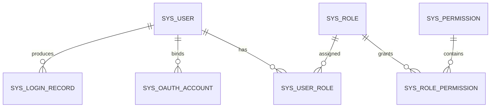

# 认证与权限模型说明

当前项目的正式登录模型分成三层：

1. **认证**：你是谁  
2. **会话**：你这次登录是否还有效  
3. **授权**：你能做什么

## 一、核心原则

权限永远绑定到系统内部用户，而不是绑定到登录方式。

也就是说：

- 账号密码登录
- 微信登录
- QQ 登录

最终都应该先落到同一个 `sys_user`，再根据这个用户的角色与权限决定能做什么。

## 二、当前表之间的关系



## 三、各表职责

| 表 | 作用 |
| --- | --- |
| `sys_user` | 系统里的真实用户 |
| `sys_role` | 角色，例如超级管理员、普通员工 |
| `sys_permission` | 具体权限点，例如查看用户、维护角色 |
| `sys_user_role` | 用户拥有哪些角色 |
| `sys_role_permission` | 角色拥有哪些权限 |
| `sys_oauth_account` | 微信 / QQ 等第三方账号绑定到哪个系统用户 |
| `sys_login_record` | 记录登录结果 |

## 四、登录流程

### 1. 账号密码登录

```text
username + password
        ↓
查 sys_user
        ↓
校验密码
        ↓
生成会话 token
        ↓
根据 user_id 查询角色和权限
```

### 2. 未来微信 / QQ 登录

```text
第三方平台身份
        ↓
查 sys_oauth_account
        ↓
拿到 user_id
        ↓
回到 sys_user
        ↓
继续使用同一套角色和权限
```

## 五、为什么这样设计

这样做有几个直接好处：

- 以后新增微信、QQ、手机号登录，都不需要重做权限系统
- 一个用户可以有多种登录方式，但只保留一套角色与权限
- 停用用户、调整角色、强制下线，都能统一处理
- 管理系统、App、小程序共用同一套后端规则

## 六、当前默认初始化

系统启动时会自动确保存在：

- `super_admin` 角色
- 若干基础权限点
- `admin / Admin@123` 管理员账号
- 管理员与超级管理员角色的绑定

这让项目在切到正式结构后，仍然能马上登录验证。
